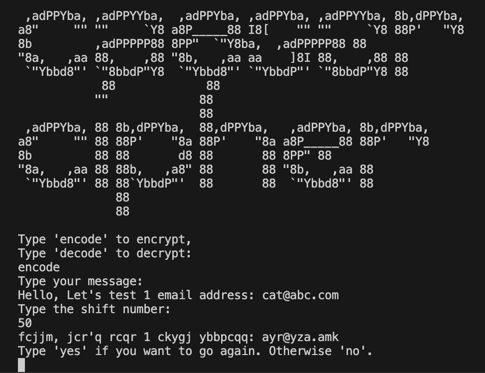
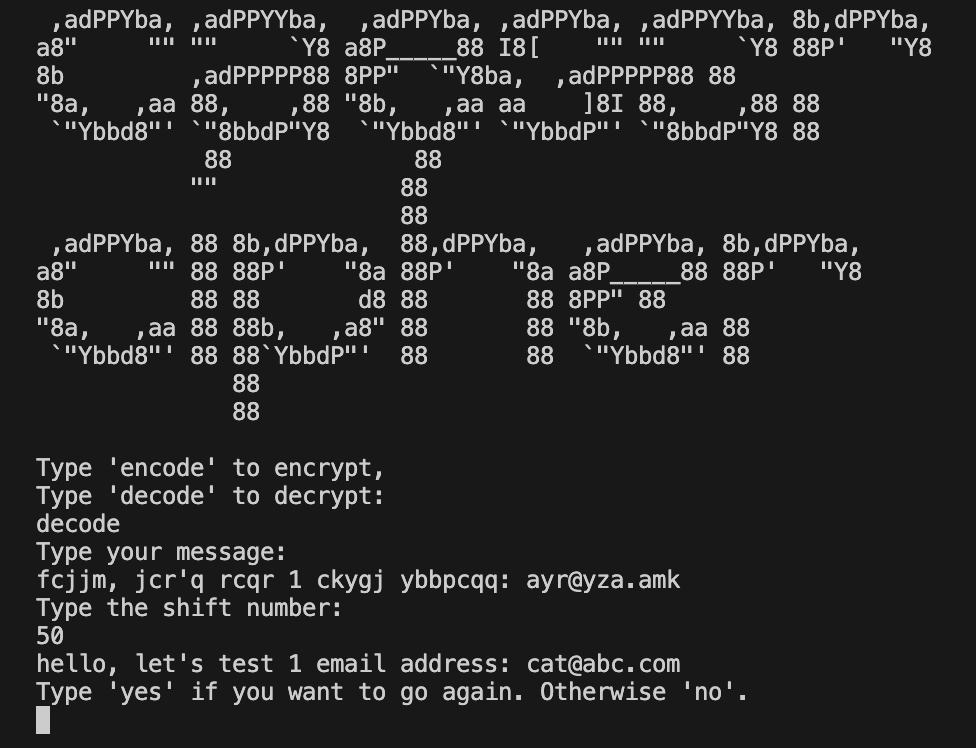

  

# Caeser Cipher 

A simple command line [Caeser Cipher](https://en.wikipedia.org/wiki/Caesar_cipher) implemented using Python.

## Instructions

1. Install required python dependencies

    ~~~zsh
    pip install -r requirements.txt
    ~~~

2. Run the following command from the root directory

    ~~~zsh
    python -m src.pkg.caeser_cipher src/pkg/caeser_cipher.py
    ~~~

3. [Optional] Run unit tests with coverage and pytest

    ~~~bash
    coverage run --source src.pkg --module pytest --verbose tests
    ~~~

## Example Usage

### Encoding

### Decoding

